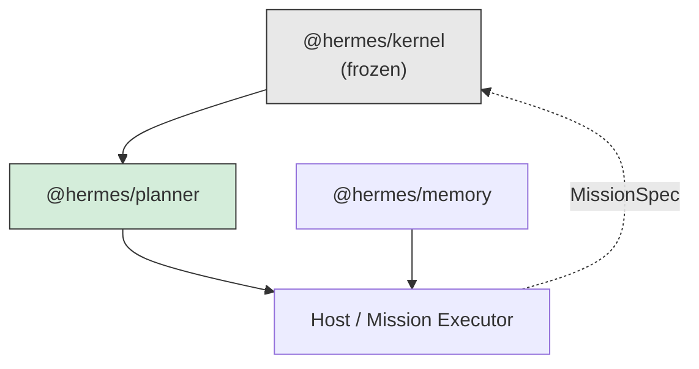
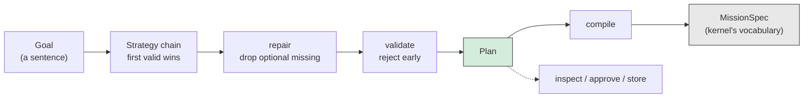

# RFC-0003: The Planner

| Field         | Value                                  |
| ------------- | -------------------------------------- |
| Status        | Implemented                            |
| Date          | 2026-07-17                             |
| Scope         | `services/planner` (`@hermes/planner`) |
| Depends on    | RFC-0001 (the Hermes kernel)           |
| Supersedes    | —                                      |
| Superseded by | —                                      |

This RFC is the design record for the planner. Like RFC-0001 and RFC-0002, it
exists because the code can tell you _what_ the service does but not _why_ it
refuses to do anything else. Where a decision has a plausible alternative that
was considered and rejected, the rejected option is recorded with the reason. If
you are about to change something in `services/planner` and this document
explains why it is the way it is, that is not a prohibition — it is the argument
you now have to beat.

Read this alongside the source. Every claim below is implemented and covered by
tests in `services/planner/tests` (201 of them).

---

## 1. Context

The kernel is finished and frozen. It runs a graph of tasks toward a goal and
refuses to learn anything else — in particular it refuses to know **what the
work means**. RFC-0001 §2 puts it as: "the kernel decides _when_ things run. It
never knows _what_ they do."

That refusal leaves a hole with a precise shape. Something has to decide that a
graph should exist, which tasks go in it, and how they depend on each other. The
kernel takes a `MissionSpec` and asks no questions about where it came from.

This service is where it comes from.

A goal — "summarise my day" — arrives as a sentence. A `MissionSpec` leaves as a
validated DAG naming capabilities that provably exist. Everything between those
two points is this package.

## 2. The organising principle

> **The kernel decides when things run. Memory decides what survives. The
> planner decides what the graph is.**

The kernel's test — "does this require the kernel to understand the _meaning_ of
the work?" — has a counterpart here: **does this require deciding what to do?**
If yes, it belongs in this service. If it is a mechanical fact about a graph
(this task depends on that one; this DAG has a cycle), the kernel already owns
it and this service must not re-own it.

Two consequences follow, and most of the design is downstream of them:

1. **Every judgement is behind an interface** (§5.1). Deciding what to do is
   eventually a model's job and is not today. So the decision is a port, and the
   default implementation is deterministic.
2. **The planner never executes anything.** It has no runtime, holds no
   scheduler, and starts no missions. It reads a catalog and returns data. A
   planner that could start a mission would be an execution engine wearing a
   planner's name.

## 3. Dependency rules

`@hermes/planner` depends on `@hermes/kernel` and **nothing else**. No memory,
no model, no network, no database, no `process.env`.

Per the platform dependency graph, the planner sits below execution services and
above memory. It does not import `@hermes/memory` — and that is a deliberate
constraint rather than an accident of sequencing. A planner that reads memory
directly would make every plan depend on a database being up. Instead, `Goal`
carries an opaque `subject` string and a free-form `context` record: a host that
wants memory-informed planning retrieves the memories and passes them in. The
planner stays pure; the composition happens above it.



The one place the two vocabularies touch is `compiler/plan-compiler.ts`, which
projects a `Plan` down onto the kernel's `MissionSpec`. That is the only module
that knows both languages, and keeping it to one module is the point.

### 3.1 The catalog port inverts the dependency

`CapabilitySource` (`ports/capability-catalog.ts`) declares the two read-only
getters the planner needs. The kernel's `Runtime` satisfies it **structurally**,
without knowing it has been adapted, and without the planner importing
`Runtime`.

This is Dependency Inversion in its literal form: the port is declared by the
consumer, in the consumer's terms. It is not decoration. Importing `Runtime`
would put `runtime.run()` within reach of this package, and the first time
someone needed "just plan and start it", the planner would quietly become an
executor. The narrow port makes that impossible rather than merely discouraged.

`tests/capability-catalog.test.ts` drives a real `Runtime` through the port, so
the structural claim is checked rather than asserted.

## 4. The gap this closes

**This is the planner's primary justification.** If you read one section, read
this one.

The kernel validates a mission's _graph_ but never its _handlers_.
`Runtime.createMission` delegates to `Mission.create`, which checks names,
cycles, duplicate task names, and attempt counts — and nothing else. Handler
resolution happens later, in `Runtime.#execute`, at dispatch:

```ts
const agent = this.#agents.get(task.handler.name);
if (!agent) throw new NotFoundError('agent', task.handler.name);
```

So **a mission naming a tool that does not exist is valid**. It is accepted,
submitted, and scheduled. Its upstream tasks run for real — sending the email,
making the commit, spending the money — and only then does the typo surface, as
a `NotFoundError` from inside the scheduler, with half the work done and nothing
to undo it with.

That is not a kernel bug, and it must not be fixed in the kernel. Resolving
handlers at the last moment is correct for a scheduler whose plugins may
register capabilities right up until `start()`. Validating at creation would
force every plugin to be loaded before any mission could be built, which is a
worse constraint than the one it removes.

But it is a real gap, and it is cheap to close one layer up. `PlanValidator`
answers "does every step name something that exists, of the right kind?" before
anything runs, by reading the `CapabilityCatalog`.

`tests/kernel-gap.test.ts` pins the gap **as a property of the kernel**. Those
tests assert that the kernel accepts a mission with a bogus handler and runs the
upstream half before failing. They live in this package deliberately: if the
kernel ever closes the gap, those tests fail, and that is the signal that a good
chunk of `PlanValidator` — and this section — should be deleted. A justification
nobody checks is folklore.

The validator also catches what the kernel cannot: a **kind mismatch**. A tool
named `summarise` and an agent named `summarise` may both exist (the kernel
keeps a registry per kind, and that is a legal configuration). Asking for the
wrong one is a different mistake with a different fix, and the kernel reports
neither until dispatch.

### 4.1 Rejected: validate inside the kernel

Considered and rejected. It would freeze plugin loading before mission creation
(above), it would put the planner's vocabulary inside a package that must not
have one, and it would break the freeze on RFC-0001 for a problem entirely
solvable above it.

### 4.2 Rejected: a "dry run" mode in the runtime

Considered and rejected. A dry run that resolves handlers without executing them
would answer the same question, but only for a runtime that is already started,
and only by walking the whole graph. The catalog answers it from a `Map` lookup,
before a runtime exists at all — which is the case that matters, because the
interesting time to reject a plan is while a human is still looking at it.

## 5. Strategies

### 5.1 The port

`PlanStrategy` (`ports/plan-strategy.ts`) is a one-method interface: given a
`Goal`, return a `Plan` or decline.

This is the socket AI plugs into, and it is why the planner can exist before any
model does. The kernel makes the same argument about its own `Agent` interface —
"a hand-written if/else, a rules table, and a future model-backed planner all
satisfy this interface identically... that is what keeps the kernel free of AI
while leaving the socket that AI plugs into" (kernel `agent.ts`). This is the
same shape of socket, one layer up.

Two outcomes, and the distinction is load-bearing:

| Outcome             | Meaning                                | Chain does          |
| ------------------- | -------------------------------------- | ------------------- |
| returns `undefined` | "this goal is not mine" — normal       | tries next          |
| throws              | "I should have handled this but broke" | records, tries next |

Declining is not a failure. It is what makes the chain a chain of responsibility
rather than a list of things that error.

A strategy's proposal need **not** be valid. The service repairs and validates
every proposal before accepting it, so a strategy may be optimistic. This
matters most for the model-backed strategy that does not exist yet: it will
produce plausible nonsense some fraction of the time, and the architecture
should absorb that rather than ask the strategy to be perfect.

### 5.2 The chain: order is policy

`PlannerService` tries strategies in order and takes the **first valid plan** —
not the best one.

There is no comparator that could rank two valid plans without knowing what the
user values: speed, cost, thoroughness, risk. Inventing one would bury a product
decision inside a service. So ranking is not attempted.

In particular, **`confidence` is deliberately not used for ranking.** It is a
strategy's report about itself, and a strategy that overstates it would win
every race it should lose. It exists so a host can require human approval below
a threshold, and so an honest strategy can admit to a guess. It is advisory, and
the core never acts on it. (`tests/planner-service.test.ts` pins this: a
`confidence: 0.1` plan from an earlier strategy beats a `confidence: 1` plan
from a later one.)

So **order is policy**, and it belongs to whoever composes the chain — one
array, at the composition root. Put the model first if novelty matters; put
templates first if cost and determinism do. They usually do.

#### Graceful degradation is the chain, not a special case

This is the part worth keeping.

> If AI fails, fall back to deterministic behaviour.

There is no circuit breaker in this package. No health check, no retry policy,
no `try`/`catch` at the call site of a model. Instead: a strategy that throws is
recorded as an attempt and the chain moves on. A model-backed strategy that is
down simply throws, and the `TemplateStrategy` behind it answers.

The mechanism **is** the architecture. That is the whole feature, and it is why
`#tryStrategy` catching everything is load-bearing rather than defensive
programming: a strategy is never required to be defensive on the service's
behalf.

The one exception is an **abort**, which is propagated rather than absorbed. An
abort is the caller leaving, not the strategy failing. Falling through to the
next strategy would ignore the abort; recording it as a strategy fault would
blame the wrong thing.

#### Rejected: score and pick the best

Considered and rejected, above: no defensible comparator exists, and a scoring
function nobody can predict is worse than an array anybody can read.

#### Rejected: run strategies in parallel and take the first to finish

Considered and rejected. It makes the outcome depend on latency, which is the
least meaningful ranking available — the cheap deterministic strategy would win
every race against the model, making the model dead code. It also spends money
on model calls whose results are then discarded.

### 5.3 Repair before validate

`repairPlan` runs before `PlanValidator`, always, and the order is not
arbitrary.

Repair drops **optional** steps whose capabilities are missing and rewires their
dependents onto the dropped step's own dependencies. Validating first would
reject the plan for exactly the steps repair was about to remove.

`optional` defaults to `false`. Silently dropping work is the more dangerous
default, so it has to be asked for.

## 6. From plan to mission

A `Plan` is deliberately **not** a `MissionSpec`. It is a superset carrying the
things the kernel refuses to know: why a step exists (`intent`), which strategy
proposed it, how confident that strategy was, whether the step may be dropped.

Two types rather than one, because the alternative is smuggling planner concepts
into `MissionSpec.metadata` and hoping nothing downstream trips over them.
Keeping a plan a first-class value means it can be inspected, logged, diffed,
shown to a human for approval, and stored — **before anything runs**.

`plan()` and `compile()` are separate methods for the same reason. A host that
wants a human to approve a plan needs the plan first and the mission only
afterwards. Fusing them would make "show me what you would do" impossible to
express. `planMission()` exists for hosts that do not want to look.



`intent` is required rather than optional. It is the only field that survives
into a human's understanding of a plan they did not write, and a planner whose
output cannot be explained is a planner nobody will let run unattended. It is
compiled into task metadata, where the kernel carries it without ever reading it
— which is also what lets a replan recover it later (§7.2).

## 7. Known limitations and extension points

### 7.1 Steps do not exchange data

**This is the planner's sharpest constraint, and it is inherited rather than
chosen.**

The kernel's `dependsOn` is an ordering constraint, not a data flow (RFC-0001
§11.4). A task does **not** receive its dependencies' outputs. So
`PlanStep.input` is static: fixed at plan time, before anything has run.

The consequence is real. A plan cannot express "fetch the calendar, then
summarise _whatever came back_". It can only express "fetch the calendar, then
run the summariser", and the summariser has to find the data some other way.

Today the honest workarounds are: an agent that calls both tools itself (agents
get the tool registry and may choose), or a shared store the two steps agree on
out of band.

This is the single largest thing the planner cannot do, and fixing it properly
means either a kernel change (task outputs addressable by dependents) or a
mission-executor layer above the kernel that runs a mission per step and threads
results between them. **It is not fixed here, and it is not hacked around
here.** Both fixes are above or below this package, and pretending otherwise
would mean this service quietly growing an execution engine.

### 7.2 Replanning cannot know whether an effect landed

A settled mission cannot be resumed. `succeeded`, `failed`, and `cancelled` are
terminal, and the DAG is frozen at creation — "nothing can add a task to a
running mission" (RFC-0001 §11.3). A mission can only be **succeeded by another
mission**, which RFC-0001 §11.3 names as the recommended shape. `Replanner` is
that composition.

It is deterministic and model-free on purpose: recovery is the last thing that
should depend on a language model being awake.

But a task that was `running` when the process died has **genuinely unknown
status**. RFC-0001 §11.2 says exactly this: "did the effect happen? That is an
at-least-once/idempotency conversation." Replanning it means running it again,
and whether that is safe depends on whether its tool is idempotent — which the
kernel does not model and this service cannot know.

So `IncompleteTaskPolicy` is **required, with no default**, because there is no
safe default:

| Policy  | Meaning                         | Right when                                     |
| ------- | ------------------------------- | ---------------------------------------------- |
| `retry` | run it again                    | tools are idempotent                           |
| `skip`  | leave it and its dependents out | a repeated effect is worse than a missing one  |
| `fail`  | refuse to replan                | a human must look first — irreversible effects |

A default here would be this code guessing about side effects it cannot see.
`retry` may double-send an email; `skip` may drop the only step that mattered.
The caller knows their tools; this code does not.

#### Dropping a dependency edge is only sound when the dependency is satisfied

This deserves its own note, because getting it wrong is silent and expensive,
and an earlier revision of this service did get it wrong.

A replan **drops** dependencies on tasks that already succeeded. It has to: the
new mission does not contain them, so a surviving `dependsOn` would name a task
that does not exist and the kernel would reject the whole spec. Dropping is also
semantically right — the dependency is satisfied; that is what "succeeded"
means.

That reasoning does **not** transfer to an abandoned task. If `charge-card` is
skipped and `send-receipt` merely has its edge dropped, then `send-receipt` runs
_immediately_, with no prerequisite, sending a receipt for a payment that may
never have happened. The caller asked for one less effect and got a worse one.

So abandonment propagates to dependents, transitively (`abandonDependents`).
Propagation stops at a succeeded task that is not being re-run, because there
the chain genuinely is satisfied. Under `includeSucceeded` a carried succeeded
task is poisoned like any other — it would run again, and its prerequisite would
not.

### 7.3 No cost or duration model

A plan cannot say what it will cost or how long it will take. `maxSteps` bounds
work and `maxDepth` bounds latency, but both are crude proxies — a step is
assumed to cost the same as any other, which is false for a step that calls a
model.

This is deliberate for now. A real cost model needs per-capability metadata the
kernel does not carry, and inventing it before the model router exists (which is
what will need it) would be guessing at a schema.

### 7.4 The template strategy is a placeholder, explicitly

`TemplateStrategy` matches declared phrasings and builds a fixed decomposition.
It is genuinely useful — it is the deterministic floor the whole degradation
argument (§5.2) stands on — but it does not _plan_. It recognises.

The `LlmStrategy` that will plan is not written, because the model router is not
written. When it arrives it implements `PlanStrategy`, goes in front of the
template strategy in the array, and nothing else changes. That is the entire
migration, and it is the payoff for §5.1.

### 7.5 An empty matcher matches nothing, not everything

`TemplateMatcher` with no declared clauses matches **nothing**. This surprises
people, so the reasoning is recorded: an empty matcher is almost certainly an
authoring mistake, and reading it as "match all" would put a catch-all at the
head of the chain and swallow every goal in the system. The failure mode of the
strict reading is a template that never fires — visible and harmless. The
failure mode of the loose one is silent and total.

### 7.6 Plans are not persisted

The planner returns a `Plan` and forgets it. Storing plans — for audit, for
"what did it decide last time", for learning — is a memory concern, and the
planner does not depend on memory (§3). A host that wants plans persisted writes
them through `@hermes/memory` itself. This is a composition gap, not a missing
feature, and it stays that way until a subsystem exists that needs it.

## 8. Testing strategy

201 tests, and the shape of them matters more than the count.

- **Behaviour, not implementation.** Tests assert on the plan produced, not on
  how the snapshot was walked. That is what let `abandonDependents` be added
  without touching a single existing assertion.
- **Real components where practical.** `tests/kernel-gap.test.ts` and
  `tests/capability-catalog.test.ts` drive a real kernel `Runtime`. The catalog
  port exists precisely so the kernel can satisfy it structurally; a stub would
  satisfy the port while proving nothing about the class it was extracted for.
- **The gap is pinned as a kernel property** (§4), so this package finds out if
  its own justification evaporates.
- **Hand-written stubs over mocks.** A strategy is a one-method interface; a
  stub that returns a plan states the scenario more plainly than a mock
  configuring one to.
- **Coverage is enforced, not observed.** `vitest.config.ts` sets a 95%
  threshold with `all: true`, so a module nobody imported counts as 0% rather
  than being absent from the report. That setting is not cosmetic:
  `planner-service.ts` and `replanner.ts` — the two most central modules — were
  once at zero coverage behind a green test run, and the `skip` bug in §7.2 was
  living in one of them.

`src/index.ts` is excluded from coverage: it is a re-export barrel with no
logic, and covering it would mean importing the entry point to no purpose.

## 9. Invariants — the short list

If you change this package, these must stay true.

1. The planner imports `@hermes/kernel` and nothing else. No memory, no model,
   no network, no `process.env`.
2. The planner never executes anything. No `Runtime`, no scheduler, no missions
   started.
3. Every judgement about what to do is behind `PlanStrategy`. The core does not
   parse a goal statement.
4. `confidence` is never used for ranking.
5. A strategy that throws never reaches the host. It becomes a recorded attempt
   and the chain continues — except on abort, which propagates.
6. Repair runs before validate.
7. Every step names a capability that exists, of the right kind, before a
   `MissionSpec` is emitted.
8. `intent` is required and non-empty on every step.
9. `IncompleteTaskPolicy` has no default.
10. A dependency edge is dropped only when the dependency is _satisfied_; an
    abandoned dependency abandons its dependents.
