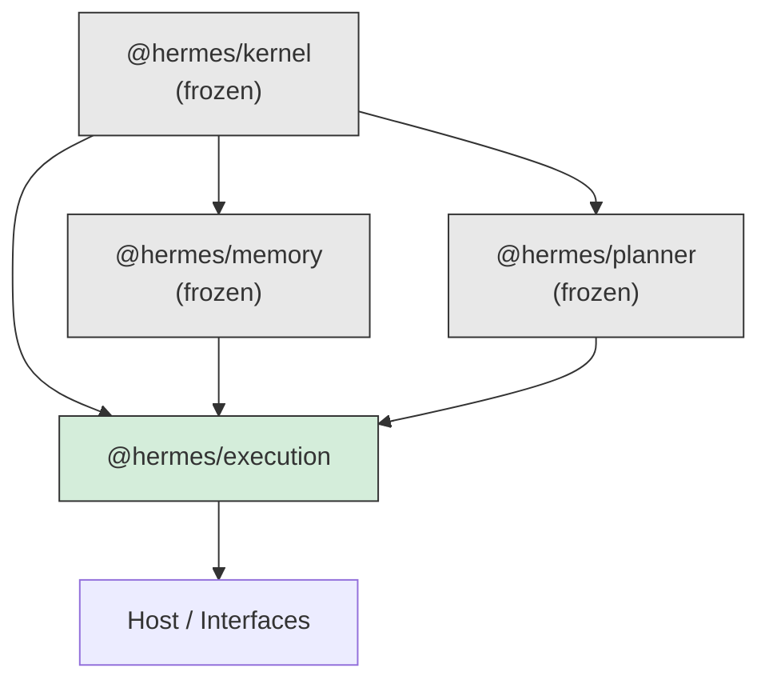
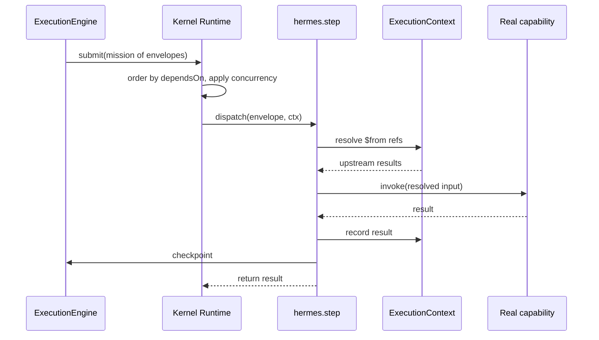
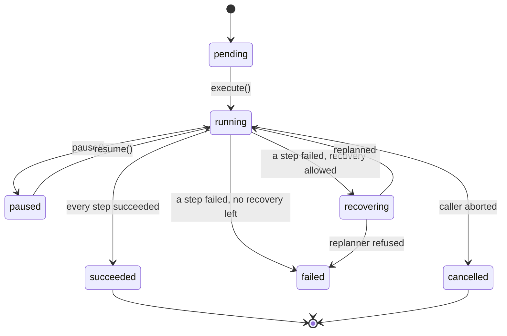

# RFC-0004: The Execution Engine

| Field         | Value                                      |
| ------------- | ------------------------------------------ |
| Status        | Implemented                                |
| Date          | 2026-07-17                                 |
| Scope         | `services/execution` (`@hermes/execution`) |
| Depends on    | RFC-0001 (kernel), RFC-0003 (planner)      |
| Supersedes    | —                                          |
| Superseded by | —                                          |

This RFC is the design record for the execution engine. Like RFC-0001 through
RFC-0003, it exists because the code can tell you _what_ the service does but
not _why_ it refuses to do anything else. Where a decision has a plausible
alternative that was considered and rejected, the rejected option is recorded
with the reason. If you are about to change something in `services/execution`
and this document explains why it is the way it is, that is not a prohibition —
it is the argument you now have to beat.

Read this alongside the source. Every claim below is implemented and covered by
tests in `services/execution/tests` (197 of them).

---

## 1. Context

Three subsystems are finished and frozen, and each refuses something.

The **kernel** runs a graph of tasks and refuses to know what they mean. The
**planner** decides what the graph is and refuses to run it. The **memory**
service remembers and refuses to judge.

Between the planner and the kernel there is a gap the planner named as its
sharpest limitation and could not close from where it sits (RFC-0003 §7.1):

> A plan cannot express "fetch the calendar, then summarise _whatever came
> back_". It can only express "fetch the calendar, then run the summariser", and
> the summariser has to find the data some other way.

That is because the kernel's `dependsOn` is an ordering constraint, not a data
flow (RFC-0001 §11.4). A task's `input` is static, fixed in the spec, and a task
does not receive its dependencies' outputs.

RFC-0001 §11.4 does not leave it there. It names the fix and reserves it:

> If this must change, the least-bad shape is probably an explicit,
> kernel-opaque reference — `input: { $from: 'a' }` resolved by the runtime at
> dispatch — because it stays plain data and keeps the mission serialisable. It
> would still need a real design for partial/multiple dependencies. **New RFC.**

This is that new RFC. The one change from what §11.4 imagined: resolution
happens **above** the kernel rather than inside it, because the kernel is frozen
and — more importantly — because it should be. A kernel that resolved references
would be a kernel that understood payloads, which RFC-0001 §2 forbids for
reasons that have not stopped being true.

## 2. The organising principle

> **The kernel decides when things run. The planner decides what the graph is.
> Memory decides what survives. The engine decides what the steps know.**

The kernel's test — "does this require the kernel to understand the _meaning_ of
the work?" — has a counterpart here: **does this require knowing what a step
produced?** If yes, it belongs in this service. If it is about _when_ something
runs, it is the kernel's, and this engine must not re-own it.

That second half is the one under constant threat, so it is stated as a rule:

> **The engine does not schedule.**

No readiness calculation, no concurrency accounting, no retry loop, no backoff,
no timeout, no failure policy. Every one of those is the kernel's, and the
engine reaches them by handing the kernel a mission whose `dependsOn` still
means what it always meant. The temptation to run steps itself — a `topoSort`
and a `Promise.all` — is the single worst change anyone could make to this
package: it would fork the scheduler, and the fork would be the one without 161
tests behind it.

## 3. Dependency rules

`@hermes/execution` depends on `@hermes/kernel`, `@hermes/memory`, and
`@hermes/planner` — public entry points only, no deep imports.



**The kernel does not know this package exists**, and that is checkable rather
than aspirational:

- The engine publishes on its **own** `EventBus`, never the kernel's (§6). The
  kernel's catalogue has no `execution:*` event and does not grow one.
- The engine registers **one ordinary agent** through the ordinary plugin API.
  From the kernel's side, `hermes.step` is a plugin's agent like any other.
- `packages/kernel` is unmodified by this work.

`tests/engine.test.ts` pins the first of those directly: it subscribes `onAny`
to the kernel bus and asserts no `execution:*` or `step:*` event ever appears on
it.

## 4. The mechanism: `$from` references

**This is the package.** Everything else is arrangement around it.

### 4.1 The shape

```ts
{ name: 'brief',
  capability: { kind: 'agent', name: 'summariser' },
  dependsOn: ['fetch'],
  input: { events: { $from: 'fetch' }, first: { $from: 'fetch', path: 'items.0' } } }
```

`$from` names a step. `path` optionally reaches inside its result with
dot-separated keys, where a numeric segment indexes an array. Absent `path`, the
whole result is substituted. References resolve anywhere inside the input —
nested in objects, in arrays, at any depth — because a model writing a plan will
nest, and a resolver that only looked at top level would fail in a way that
looks like the model's fault.

### 4.2 How it runs

A plan step naming `tool:calendar.today` does **not** compile to a task naming
`tool:calendar.today`. It compiles to a task naming `agent:hermes.step` whose
_input_ is an envelope saying which capability to run and what to pass it. At
dispatch, that agent resolves the references against the execution context —
which by then holds every upstream result — and invokes the real capability.



Resolution happens **at dispatch and never earlier**. That is load-bearing
rather than incidental: on a retry it runs again, so a step retried after its
dependency was itself retried reads the newer value rather than a stale capture.

### 4.3 Why a reference and not a function

A mapping function would be more expressive. It is rejected for one reason: **a
function is not data.** A plan carrying `(prev) => prev.items[0]` cannot be
serialised, so it cannot be checkpointed, cannot be stored, cannot be shown to a
human for approval, and cannot be produced by a model that emits JSON. Every one
of those is something this system does.

The cost is real and worth naming: `path` is a lookup, not a transform. There is
no way to express "the sum of a's results" in a plan. That work belongs in a
step — a capability that takes the values and sums them — which keeps the
transform testable, named, and visible to the scheduler rather than hidden in a
plan's punctuation.

### 4.4 A reference must be a declared dependency

`validateRefs` enforces two rules before anything runs. The second is the subtle
one and it is the most valuable check in the package.

If step `b` references `a` without declaring `dependsOn: ['a']`, the kernel is
free to run them concurrently, and `b` resolves against a result that does not
exist yet. It would fail — _usually_. Under load, or with a fast `a`, it would
pass. **A race that passes in tests and fails in production is the worst failure
this design could have**, so the two are required to agree, and disagreement is
a compile-time error rather than a coin toss.

#### Rejected: infer `dependsOn` from references

It reads as a kindness and is a trap. The plan would then have two sources of
truth for its own shape, and the planner's validator — which checks the graph
for cycles and depth — would be checking a graph that is not the one that runs.
Worse, a cycle introduced purely by references would be created _after_ the only
thing that looks for cycles had already approved the plan. Requiring the author
to say what they mean keeps one graph, validated once.

### 4.5 A missing key throws

`resolveRefs` throws for a path that does not exist rather than yielding
`undefined`. The asymmetry with plain JavaScript is deliberate: `a.b.c` quietly
evaluating to `undefined` is the single most common way a data-flow bug reaches
production wearing a disguise. Here the step that produced the value is named in
the error, so the fix is a plan edit rather than an afternoon.

A step that succeeded with a result of `undefined` still resolves, and a path to
`false`, `null`, `0` or `''` resolves to that value. `has()` keys off the step's
_state_, never off whether its result is defined — conflating "returned
undefined" with "did not run" would make a void tool impossible to depend on.

## 5. The state machine



Two of these states have no kernel equivalent, and they are why the machine
exists at all rather than reusing `MissionState`:

- **`paused`** — the kernel has no pause (§7.2).
- **`recovering`** — a settled mission being succeeded by another is, from the
  kernel's side, two unrelated missions. From here it is one execution that
  stumbled.

`execute()` resolves for `succeeded` and **throws** for everything else. The
asymmetry is deliberate: a caller that forgets to check `snapshot.state` would
treat a total failure as success, and the whole point of a promise is that the
unhappy path is the one you cannot forget. `paused` is the one exception that
resolves, because pause is a decision rather than an incident.

## 6. Events

The engine publishes on its own `EventBus<ExecutionEventMap>`. `EventBus<M>` is
generic and public, so the engine gets the kernel's backpressure, error routing
and `waitFor` for free **without the kernel learning a vocabulary**. That is
reuse of a mechanism, not coupling to a catalogue.

Pushing `execution:*` onto the kernel's bus was rejected: `@hermes/memory`'s
`onAny` listener persists every kernel event, and it would start writing rows
about a concept the kernel does not have, through a seam RFC-0001 §11.2 reserved
for kernel events.

`mission:submitted` is the one place the two vocabularies are deliberately
joined. It carries the kernel `MissionId` for an execution, and it is the only
key between the engine's history and the audit log memory is already writing.
Without it, they would be two accounts of the same events with nothing between
them.

## 7. Known limitations and extension points

### 7.1 The kernel's view of a handler is the envelope

**This is the design's one real cost, and it is paid in the audit log.**

Every task in a compiled mission has
`handler: { kind: 'agent', name: 'hermes.step' }`. So `mission_task.handler` in
`@hermes/memory`'s projection is the envelope's name rather than the real
capability, for every task of every mission this engine submits.

It is mitigated, not ignored. The real capability and the step's intent are
written into task metadata at compile time, which the kernel carries untouched
and memory persists — so nothing is lost, it moved one column over. And the
engine's own history (`ExecutionSnapshot.steps`) names real capabilities
directly, because it never went through the kernel.

#### Rejected: real handlers, no data flow

The planner's `compilePlan` already does this, and a host that does not need
step data flow should use it and skip this package entirely — it is simpler and
its missions read honestly in the audit log. But it cannot thread outputs, which
is the whole reason this package exists.

#### Rejected: a mission per step (RFC-0001 §11.3 option 1)

The kernel's own RFC names this as the cheapest option, and it was still
rejected. Data flow would be trivial — the engine resolves between missions —
but the engine would then own DAG ordering **and the failure policy**, which
means reimplementing the parts of the scheduler that decide what runs after a
failure. RFC-0001 §11.3 concedes it "loses cross-step concurrency accounting".
Against that, the envelope keeps every kernel guarantee and costs one column in
a log.

It also breaks the planner's `Replanner`, which takes a single `MissionSnapshot`
covering the whole plan (RFC-0003 §7.2). With a mission per step there is no
such snapshot to give it.

#### Rejected: mutable missions (RFC-0001 §11.3 option 3)

Needs a kernel change, and RFC-0001 says "do not reach for (3) casually".

### 7.2 Pause is cancel-and-checkpoint

The kernel has no pause and this does not add one. A mission runs to settlement
or is cancelled, and there is no way back from the second (RFC-0001 §11.3). So
`pause` cancels the mission, the checkpoint becomes authoritative, and `resume`
submits a **new** mission for the unfinished part.

#### Rejected: the envelope blocks at dispatch until un-paused

This is the obvious implementation and it deadlocks. A blocked envelope **holds
its concurrency slot**. Pause a plan wider than the concurrency budget and the
runtime stops with every slot held by a step waiting for a resume that needs a
slot to happen. RFC-0001 §11.3 names the same trap for sub-missions.

The payoff for taking the cancel route is that **pause and crash recovery are
the same code path**. A process that dies mid-execution leaves exactly what a
pause leaves: a checkpoint. `tests/pause-resume.test.ts` proves it by killing a
runtime and picking the execution up in a new one.

A step that was mid-flight when the pause landed is cancelled, and what that
means for its effects is the same at-least-once conversation RFC-0001 §11.2 has
— which is why resume takes an `incomplete` policy rather than guessing.

### 7.3 Recovery is off by default

`RecoveryPolicy.maxAttempts` defaults to 0. Recovery re-runs steps, and whether
that is safe depends on whether their capabilities are idempotent — which this
package cannot know, exactly as the planner cannot (RFC-0003 §7.2). An engine
that replanned by default would double-send an email the first time someone's
network blipped, and they would not have asked for it.

`incomplete` is required whenever recovery is enabled, and deliberately has no
default, for the same reason `Replanner` refuses to default it: there is no safe
default.

This is also **not** retry. The kernel already retries a task that threw, and a
host that wants a step tried three times should say `maxAttempts: 3` on the
step. Recovery is the layer above: the kernel has exhausted its retries and the
question is whether the _plan_ should be reshaped. Collapsing the two would make
a plan that is wrong retry itself identically until the budget ran out.

### 7.4 `RecoveryExhaustedError` is a guard, not a path

`#recover` catches `NothingToReplanError` and converts it. That catch is
**currently unreachable**, and it is kept deliberately.

`Replanner` refuses when nothing is left to carry, which needs every remaining
step to be abandoned or mid-flight. But `#reconcile` has already resolved every
step the kernel settled into a terminal state, and the replanner treats `failed`
as outstanding work (RFC-0003 §7.2). So the refusal cannot fire while those two
agree.

It is not dead code: without it, a `NothingToReplanError` — a _planner_ error —
would reach a caller of the _engine_, which is exactly the cross-layer leak
`errors.ts` exists to prevent. If the reconciler or the replanner's `RESUMABLE`
set ever changes, this is what stops that leak from being how anyone finds out.
It is marked `c8 ignore` with this reasoning rather than tested with a scenario
that cannot occur.

### 7.5 An execution is only as cancellable as its steps

The kernel's cancellation is cooperative (RFC-0001 §11.1). A step that ignores
its `signal` keeps running, and `cancelMission` on a mission full of such steps
never settles — so `pause` and abort would both hang.

This is inherited, not introduced, and it is not worked around: a workaround
would mean the engine abandoning a mission it cannot stop, which trades a hang
for a zombie. `tests/helpers/fixtures.ts` carries both a `waits` tool (honours
its signal) and a `hang` tool (does not) precisely so the difference is visible
in the test suite rather than discovered in production.

### 7.6 A step result must be JSON

A checkpoint is only useful if it outlives the process, so anything
unserialisable in one — a live `Error`, a class instance, a closure, a `BigInt`,
a circular reference — makes resume-after-crash a lie that only shows up in
production.

The constraint is enforced rather than documented: `InMemoryCheckpointStore`
round-trips through `JSON.stringify` even though it is a `Map` and does not need
to, so the in-memory store fails on exactly what Postgres would fail on, in a
test, on a laptop. A step returning something unserialisable gets
`CheckpointCorruptError` at the save that would otherwise have silently lost it.

### 7.7 One runtime hosts one engine

The engine's envelope is a plugin, and the kernel accepts plugins only in its
`created` state (`runtime.ts` `use`). So an engine must be constructed and
registered before `runtime.start()`, and two engines cannot share a started
runtime.

This is not a limitation to route around — it is what makes a running runtime's
capabilities knowable. It does mean the envelope cannot close over an execution
that did not exist yet, which is why `StepEnvelope` carries an `executionId` and
the sink is resolved per dispatch. That constraint turns out to be a feature:
two concurrent executions share the agent, and keying on an id that travels
_with the task_ makes "resolve one execution's references against another's
results" unrepresentable rather than merely unlikely.

### 7.8 Checkpoints are not in Postgres yet

`CheckpointStore` is a port with one implementation, and it is in-memory. That
is completely correct for a single-process host and for every test, and it
cannot do the one thing checkpoints are ultimately for.

A `PgCheckpointStore` belongs here and is straightforward: `@hermes/memory`
exports `PgDatabase`, `Database` and `migrate` publicly, and the migrator keys
its ledger on migration _name_ (`text PRIMARY KEY`), so a second package can own
its own migrations directory without colliding with memory's. It is not written
because nothing yet runs Hermes across a restart; the port exists so that when
something does, the engine does not change.

#### Rejected: store checkpoints as memories in `@hermes/memory`

It would fit — memory owns persistence, and this is persistence. Rejected
because a checkpoint is _operational state_, not a memory. Memory's records are
scored by importance, pruned when they stop mattering, and retrieved by semantic
similarity (RFC-0002 §8). Every one of those is wrong for a checkpoint: it is
worthless the moment its execution settles and priceless until then, and no
pruner can be taught that distinction without learning what an execution is —
which would make memory depend on this package and invert the dependency graph.

### 7.9 No cost or duration accounting

The engine reports what ran and what it returned, not what it cost. Same reason
as RFC-0003 §7.3: a real cost model needs per-capability metadata the kernel
does not carry, and inventing it before the model router exists would be
guessing at a schema.

## 8. Testing strategy

197 tests, and the shape matters more than the count.

- **A real kernel, always.** Every engine test builds an actual `Runtime` with
  real tools and runs real missions. The engine's central claim is that it
  composes the kernel rather than reimplementing it, and against a fake runtime
  that claim could be false while the suite stayed green.
- **Pure things tested purely.** `refs.ts` is the mechanism the package exists
  for, and it is a lookup in, a value out — so it is tested against plain
  objects. 43 of the tests are there, because that is where the risk is.
- **Cancellation tested honestly.** The fixture has both a cooperative tool and
  one that ignores its signal, because §7.5 is a real property of the system and
  a suite that only used well-behaved tools would imply a guarantee that does
  not exist.
- **Coverage enforced, not observed.** 95% thresholds with `all: true`, so an
  untested module reports 0% rather than vanishing from the report — the setting
  that would have caught the planner's two untested modules before they shipped.

Type-only modules (`events.ts`, `ports/checkpoint-store.ts`) are excluded: they
emit no runtime code, so v8 scores them 0% of nothing.

## 9. Invariants — the short list

If you change this package, these must stay true.

1. The engine does not schedule. No readiness, no concurrency, no retry, no
   backoff, no timeout, no failure policy — all the kernel's.
2. The kernel does not know this package exists. No `execution:*` on its bus, no
   kernel change, no deep imports.
3. References resolve at dispatch, never at compile time.
4. A reference must name a declared dependency. The graph is validated once.
5. `has()` is true only for a step that **succeeded**.
6. Anything in a checkpoint survives `JSON.stringify`.
7. The envelope rethrows. The engine records; the kernel decides.
8. Recovery is off unless asked for, and `incomplete` has no default.
9. `execute()` throws for anything that is not success, except `paused`.
