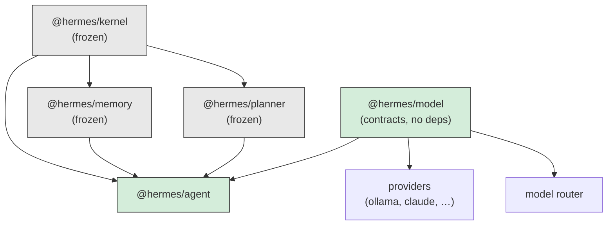
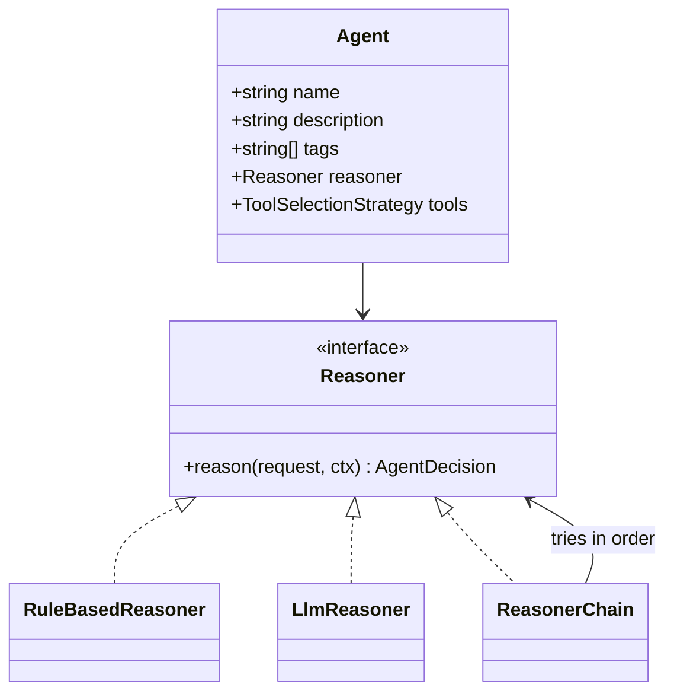
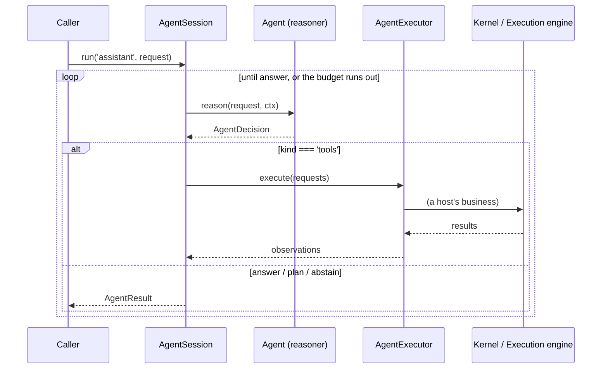

# RFC-0005: The Agent Framework

| Field         | Value                                                                  |
| ------------- | ---------------------------------------------------------------------- |
| Status        | Implemented                                                            |
| Date          | 2026-07-17                                                             |
| Scope         | `services/agent` (`@hermes/agent`), `packages/model` (`@hermes/model`) |
| Depends on    | RFC-0001 (kernel), RFC-0002 (memory), RFC-0003 (planner)               |
| Supersedes    | —                                                                      |
| Superseded by | —                                                                      |

This RFC is the design record for the agent framework and for the model
contracts it is written against. Like RFC-0001 through RFC-0004, it exists
because the code can tell you _what_ the subsystem does but not _why_ it refuses
to do anything else. Where a decision has a plausible alternative that was
considered and rejected, the rejected option is recorded with the reason. If you
are about to change something here and this document explains why it is the way
it is, that is not a prohibition — it is the argument you now have to beat.

Read this alongside the source. Every claim below is implemented and covered by
tests: 172 in `services/agent/tests`, 42 in `packages/model/tests`.

---

## 1. Context

Four subsystems are finished and frozen, and each refuses something.

The **kernel** runs a graph of tasks and refuses to know what they mean. The
**planner** decides what the graph is and refuses to run it. **Memory**
remembers and refuses to judge. The **execution engine** threads data between
steps and refuses to schedule.

None of them decides _what should happen_. A goal arrives at the planner already
formed; a mission arrives at the kernel already shaped. Something has to look at
"what is on today?" and work out that it means a calendar lookup and a summary.

This is that something. It is also, deliberately, the only subsystem in Hermes
that will eventually need a model to do its job — which is why every part of it
is an interface with a deterministic default behind it.

## 2. The organising principle

> **The kernel decides when things run. The planner decides what the graph is.
> Memory decides what survives. The engine decides what the steps know. The
> agent framework decides what should happen — and never makes it happen.**

The kernel's test — "does this require the kernel to understand the _meaning_ of
the work?" — finally has a subsystem that answers yes to everything. So the test
here is the inverse: **does this do anything?** If yes, it belongs somewhere
else.

That is not a slogan; it is a type. An agent's only output is an
`AgentDecision`:

```ts
type AgentDecision =
  | { kind: 'answer'; content: unknown }
  | { kind: 'tools'; requests: ToolRequest[] }
  | { kind: 'plan'; goal: Goal }
  | { kind: 'delegate'; agent: string }
  | { kind: 'abstain' };
```

**There is no variant that says "and I already did it."** A reviewer never has
to check whether a new reasoner secretly called a tool; the return type does not
let it say so. This is the same trick the kernel plays with `MissionSpec` — a
mission is data, so it can be inspected before it runs — applied one layer up to
the thing most likely to want to cheat.

## 3. Dependency rules

`@hermes/agent` depends on `@hermes/kernel`, `@hermes/memory`, `@hermes/planner`
and `@hermes/model` — public entry points only, no deep imports. Nothing depends
on it.



Note what the graph does **not** contain: an arrow from `@hermes/agent` to
`@hermes/execution`. The framework does not depend on the execution engine, does
not import it, and has never heard of it. Tool requests leave through
`AgentExecutor`, an interface declared here and implemented by a host — see
§5.2.

### 3.1 There are two things called "agent"

The kernel has an `Agent` and so does this framework, and they are different
things wearing the same word. This is the single most likely source of confusion
in the codebase, so it is stated plainly:

|           | kernel `Agent`                   | framework `Agent`         |
| --------- | -------------------------------- | ------------------------- |
| is handed | the tool registry (`ToolAccess`) | nothing that can act      |
| does      | calls tools, returns a value     | returns a decision        |
| lives     | inside one kernel task           | across a session of turns |
| is        | a _handler_                      | a _decider_               |

The kernel's is correct for the kernel: "an agent is handed the tool registry
and chooses what to call" (kernel `agent.ts`) is exactly what a task handler
with authority should be. This framework's is correct here, for the reasons in
§2.

**They meet in exactly one file**: `adapters/kernel-agent.ts` (§7.4). Everywhere
else they stay apart, which is what keeps "agents never execute tools" true
while the kernel's agents go on executing tools, which is their job.

#### Rejected: rename one of them

Considered. `Reasoner`, `Decider`, `Brain` were all candidates for this one. It
is rejected because the word is right: this _is_ what the literature and every
user means by an agent, and the kernel's is the specialised one. Renaming the
general concept to protect the specialised one is the wrong way round, and the
table above is cheaper than a name nobody would use.

## 4. Why the model contracts are their own package

`@hermes/model` holds `ChatModel`, `ToolCallingModel`, `StreamingModel`,
`CompletionModel`, `EmbeddingModel`, the message types, and the error hierarchy.
It has **zero dependencies** — not even on the kernel.

It could have lived in `@hermes/agent`. That is rejected, and the reason is the
dependency graph above: an Ollama provider is an HTTP client and nothing more,
and it would have to import a _reasoning framework_ to declare its own shape.
The model router — which picks between providers — would have to import the
thing that will call it. Both are the graph pointing outward, which the platform
rule forbids.

So the contracts sit below all three consumers. Everything that touches a model
depends on this; this depends on nothing.

The payoff is concrete and already collected: **`LlmReasoner` is finished and
tested, and no provider exists.** It is written against `ChatModel`, its tests
run against a fake that implements the same interface, and the day a provider
ships it is constructed with one and works. That is not a stub or a sketch — it
is the reasoning layer completed ahead of the provider layer, which is only
possible because the contract is separable from both.

### 4.1 Nothing in the contracts can execute

A model is _told_ a capability exists (`ToolDefinition`) and _requests_ one
(`ToolCall`). There is no field, method, or type anywhere in `@hermes/model`
that runs anything. So "agents never execute tools directly" is not enforced
only by the agent framework's types — it is unrepresentable two layers down.

### 4.2 `EmbeddingModel` is a superset of memory's `EmbeddingProvider`

Memory already declares an embedding interface. `@hermes/model` redeclares it
rather than importing it, because importing would make the contracts package —
which providers depend on — depend on the memory service, dragging Postgres and
`pg` into an Ollama client that wanted an HTTP call.

That is a duplication, and it is the lesser evil. It is mitigated by making the
redeclaration a **strict superset**, field for field and signature for
signature, with `info` added. So every `EmbeddingModel` is already an
`EmbeddingProvider`, and a host hands the same object to a model router and to
`MemoryService` with no adapter. The reverse does not hold and should not: a
bare embedder has no `ModelInfo` and a router has nothing to route on.

This is why `EmbeddingModel.embed` takes an `AbortSignal` rather than
`ModelOptions`, which would have been more symmetrical with the rest of the
file. The one seam where two packages must agree is worth an asymmetry — and
`temperature` means nothing to an embedder anyway.

`services/agent/tests/memory-adapter.test.ts` pins it with compile-time
assertions, because it is the only place both interfaces are visible at once.

### 4.3 `ModelError.retryable` is on the base class

A router falling back from Claude to Ollama has one question about a failure:
_is it worth trying someone else?_ A rate limit is; a malformed request is not,
and retrying it elsewhere fails twice and bills for it.

If each provider threw its own shapes, that question would be answered by
matching on message text per provider — the thing that breaks silently when a
vendor rewords a string. So the classification is the contract.

The one worth arguing about is **`ContextTooLongError`, which is not
retryable**. It looks like a capacity problem, so a router is tempted to reach
for a model with a bigger window. But the same oversized prompt fails at three
providers and bills for two, and the fix is never "ask someone else" — it is to
send less. A caller that genuinely wants a bigger window can catch it and choose
one; a router must not do it silently.

## 5. Architecture

### 5.1 An agent is identity plus a reasoner



`Agent` has no `reason` method of its own and no subclasses. It is a name, a
description, some tags, and a reasoner.

That makes the four agent kinds the objectives asked for stop being kinds:

| asked for                | what it is here                                   |
| ------------------------ | ------------------------------------------------- |
| deterministic agent      | an agent whose reasoner is `RuleBasedReasoner`    |
| AI-powered agent         | an agent whose reasoner is `LlmReasoner`          |
| composite agent          | an agent whose reasoner is `ReasonerChain`        |
| specialist agent         | an agent with narrow `tags` that abstains readily |
| future distributed agent | an agent whose reasoner calls a remote one        |

**None of them needed a class.**

#### Rejected: an `abstract class Agent` hierarchy

`LlmAgent`, `RuleAgent`, `CompositeAgent` beneath an abstract base. It reads
well and it fuses two things that vary independently: _who this agent is_ and
_how it thinks_. Under that design, giving a rule-based agent a model means
constructing a different class, re-registering it under the same name, and
hoping nothing held a reference to the old one. Here it is one field.

`AgentFactory` is absent for the same reason: the thing a factory would have
existed to vary is a field, and `defineAgent({ ..., reasoner })` is the factory.

### 5.2 What a reasoner is not given

`AgentContext` is the enforcement, and it is defined by its absences:

| absent          | so a reasoner cannot | it gets instead                                 |
| --------------- | -------------------- | ----------------------------------------------- |
| `AgentRegistry` | invoke another agent | `{ kind: 'delegate' }`, resolved by the session |
| `MemoryService` | write a memory       | `MemoryAdapter`, which only reads               |
| `Runtime`       | start a mission      | nothing; that is the host's                     |
| `AgentExecutor` | run a tool           | `ctx.capabilities` — the read-only half         |

That last row is the subtle one. `AgentExecutor` has both `available()` and
`execute()`, and a reasoner genuinely needs the first — it has to know what
exists to ask for it. So the executor is **not on the context at all**. The
session calls `available()`, runs the result through the agent's
`ToolSelectionStrategy`, and puts only `capabilities` on the context. The
reasoner sees what it is meant to see and cannot widen its own reach.

#### Why memory is read-only, and how anything is ever remembered

An agent that learns something worth keeping **decides** to keep it — a
`ToolsDecision` naming `memory.remember`, which `@hermes/memory` already
registers as a real tool through its plugin. The write goes out through the same
door as every other effect: a decision, executed by something else, with an
observation coming back. It is visible to the scheduler, it appears in the audit
log, and an approval middleware can refuse it.

A reasoner holding `MemoryService` could write on a path nobody watches, and
"the agent remembered something during reasoning" is exactly the effect you want
to be able to see, cost, and veto.

### 5.3 The session loop



The session drives the think-act-observe cycle, and **that is reasoning**:
deciding whether there is another turn is a judgement about the conversation.
The _acting_ leaves through `AgentExecutor`, an interface this package declares
and never implements. The session cannot tell whether anything ran, only what
came back.

That line is worth defending explicitly because it is the one a future change
will blur. A session that reached for a `Runtime` to "just run this quickly"
would have moved execution into the reasoning layer, and the only thing stopping
it is that there is nothing here to reach for.

`AgentExecutor.execute` takes the **whole batch**, not one request, because only
the implementation knows what may run together — the execution engine has a
concurrency budget and a scheduler; this framework has neither and must not
pretend to by looping.

### 5.4 A failing tool is information, not an exception

`ToolObservation` carries `ok: false` and an error rather than throwing. A tool
failing is _something the agent should reason about_ — retry differently, try
another approach, give up and explain — and a session that threw on the first
failed tool could never recover from one.

`AgentExecutor.execute` therefore rejects **only** when it could not run
anything at all: the runtime is stopped, the caller aborted. That distinction is
what lets a session tell "the tool said no" from "there is nothing to run tools
with".

### 5.5 Order is policy, again

`ReasonerChain` takes the first reasoner that does not abstain. It does not
rank, and `confidence` is deliberately not used to choose — it is a reasoner's
report about itself, and one that overstates it would win every race it should
lose.

This is the third time the platform has made this argument: `PlanStrategy`
(RFC-0003 §5.2) and now `Reasoner`. The repetition is the point — one shape,
learned once. So is the fallback story:

> There is no circuit breaker in this package. No health check, no `try`/`catch`
> around a model call. A model-backed reasoner that is down simply throws, and
> the `RuleBasedReasoner` behind it answers. **The mechanism is the
> architecture.**

## 6. Middleware

`(request, ctx, next) => AgentDecision` — the shape every reader already knows.
An `onBeforeDecide`/`onAfterDecide` hook pair would be more discoverable and
strictly less capable: it cannot wrap a `try`/`finally`, cannot short-circuit
without a sentinel, and cannot time the thing it brackets without stashing state
between two callbacks.

What middleware is really for is a **guard**, and it works here for a reason
that is worth naming: `next` returns a _decision_, which is data describing what
should happen and has not happened yet. So a middleware can read it, rewrite it,
or refuse it, and nothing has been done in the meantime.

**In a framework where the agent had already run the tool, an approval
middleware could only apologise.** That is the clearest single demonstration of
why the whole subsystem is shaped this way.

## 7. Known limitations and extension points

### 7.1 `TreeSearchReasoner` is not written

The objectives name it. It is absent, and the absence is deliberate rather than
an oversight.

A tree search over decisions needs three things this system does not yet have: a
way to _evaluate_ a candidate decision without executing it, a way to roll back
if it were executed, and a cost model to decide how deep to go. Written today it
would be a breadth-first loop over `LlmReasoner` calls with an invented scoring
function — an expensive way to look sophisticated, and a scoring function nobody
could defend (§7.3).

The `Reasoner` port is what makes waiting cheap: it goes in as a field when it
has something to search _with_. Nothing else changes.

### 7.2 `AllTools` is the default and does not scale

Every capability offered to a model is tokens spent on every turn, and a model
handed sixty tools picks worse than the same model handed the six that matter.
So the default — offer everything — is honestly the wrong one at scale.

It is the default anyway, because the alternative is a framework that refuses to
run until a host has made a decision it has no information to make yet. A
deterministic agent ignores the list entirely, so the default costs it nothing;
a model-backed agent should set `tools:` and `LlmReasoner`'s docs say so.

The real fix is a retrieval-backed selector, and `ToolSelectionStrategy.select`
is **synchronous** specifically to stop a naive one: a selector that embedded
the request would make every turn of every agent wait on a model call, and
hiding that behind an interface everyone calls by default is how a system gets
slow in a way nobody can find. A selector that needs I/O belongs behind a cache
the host populates from outside.

### 7.3 There is no `HybridReasoner` that merges

`ReasonerChain` is named a chain rather than a hybrid because it does not merge
anything: it tries reasoners in order and takes the first answer.

A genuine hybrid — rules and a model deciding together — needs a rule for what
to do when they disagree, and there is no defensible one. Trusting the rules
makes the model decorative; trusting the model makes the rules a slow warm-up;
weighting them by `confidence` trusts a number a reasoner made up about itself
(§5.5). Each is a product decision wearing a scoring function, so none is made
here. A host that has a defensible merge writes a `Reasoner` that does it — the
port is right there, and it is the honest place for a judgement this framework
cannot make.

### 7.4 A session inside a kernel task is invisible to the scheduler

`asKernelAgent` runs a whole session — decisions, tools, turns, delegation —
inside a single kernel task. So six model calls and four tools look like _one
long task_: no per-step retry, no concurrency accounting, no events.

That is exactly the limitation RFC-0001 §11.3 names for an agent doing unbounded
work in a single task, inherited rather than introduced:

> an _agent_ can do unbounded work inside its single task by calling tools in a
> loop — which is enough for a lot, but the sub-steps are invisible to the
> scheduler.

The alternative is available and better when it matters: let the agent return a
`PlanDecision` or a `ToolsDecision` and have `@hermes/execution` run the steps
as real kernel tasks. The adapter is for the case where an agent is genuinely
one step of someone else's mission, and there it is the right shape.

`kernelExecutor` also cannot honour a `kind: 'agent'` request: the kernel gives
an agent no way to invoke another agent (`runtime.ts` `#toolAccess`). It reports
that as a failed observation naming `delegate` rather than throwing, so the
agent gets to reason about the refusal.

### 7.5 An agent cannot ask a question

There is no `{ kind: 'ask' }` decision. An agent that needs a clarification can
only answer with the question and end the session, which loses the turn state
that made the question worth asking.

Adding the variant is easy; making it _mean_ something is not, because it needs
a channel back to a human that does not exist yet — a Telegram interface, a REST
stream, a CLI prompt. It waits for one of those, and it is a union member and a
session branch when it comes.

### 7.6 Sessions are not persisted

`AgentResult` carries the whole transcript and the framework then forgets it.
Storing sessions — for audit, for "what did it decide last time", for learning —
is a memory concern, and the framework does not write memory (§5.2).

A host that wants them persisted writes them through `@hermes/memory` itself.
This is a composition gap rather than a missing feature, and it stays that way
until a subsystem exists that needs it. Same call the planner made about plans
(RFC-0003 §7.6).

### 7.7 The turn budget is a bound, not a plan

`maxTurns` defaults to 8. A model that asks for a tool, reads the result, and
asks for the same tool again will do that forever, and each turn is a model call
somebody pays for. 8 is enough for a genuinely multi-step task and small enough
that a loop costs pennies rather than a bill.

It is a blunt instrument. A better one would detect the _repetition_ rather than
count the turns — the transcript has everything needed — and that needs a
similarity judgement, which needs a model, which is the thing that is looping.
The budget is what there is until something can tell "trying a different angle"
from "stuck".

## 8. Testing strategy

172 tests in the framework, 42 in the contracts.

- **The fake model is not a compromise.** `FakeChatModel` implements
  `@hermes/model`'s `ToolCallingModel` — the same interface a provider will
  implement — so a reasoner test exercises the real contract. The only thing it
  does not test is whether a provider honours that contract, which is the
  provider's test to write.
- **A real kernel where the two meet.** `tests/kernel-adapter.test.ts` builds an
  actual `Runtime` with real tools and runs real missions, because §3.1 and §7.4
  are claims about composition and a fake runtime would let them be false while
  the suite stayed green.
- **The central rule is tested first.** "A model asking for a tool produces a
  decision, not a tool call" is the first test in `llm-reasoner.test.ts`. If it
  ever fails, the design is broken rather than the code.
- **Cross-package type claims are compile-time tests.** §4.2's superset claim is
  an assignment in `memory-adapter.test.ts`, plus a `@ts-expect-error` proving
  it does not hold in reverse. If either interface drifts, `pnpm typecheck`
  fails.
- **Coverage enforced, not observed.** 95% thresholds with `all: true`.

Type-only modules (`ports/**`, `context.ts`, `contracts.ts`) are excluded: they
emit no runtime code, so v8 scores them 0% of nothing.

## 9. Invariants — the short list

If you change this subsystem, these must stay true.

1. An agent's only output is an `AgentDecision`. No variant means "I did it".
2. `AgentContext` carries nothing that can act: no registry, no `MemoryService`,
   no `Runtime`, no executor.
3. The framework declares `AgentExecutor` and never implements it. (
   `kernelExecutor` forwards to the kernel and runs nothing itself.)
4. Agents read memory. Writes are decisions.
5. Agents may ask for a plan. The framework does not call the planner to decide
   _for_ them unless a host wires `PlannerAdapter` in.
6. `@hermes/model` has zero dependencies and nothing in it can execute.
7. A reasoner that throws is a fall-through, not a failure. An abort propagates.
8. `confidence` is never used to choose between reasoners.
9. An agent is identity plus a reasoner. No agent subclasses.
