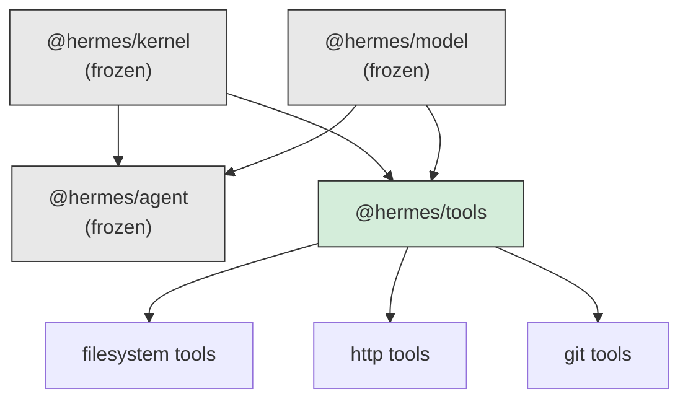

# RFC-0006: The Tool Framework

| Field         | Value                                      |
| ------------- | ------------------------------------------ |
| Status        | Implemented                                |
| Date          | 2026-07-17                                 |
| Scope         | `packages/tools` (`@hermes/tools`)         |
| Depends on    | RFC-0001 (kernel), RFC-0005 (model, agent) |
| Supersedes    | —                                          |
| Superseded by | —                                          |

This RFC is the design record for the tool framework. Like RFC-0001 through
RFC-0005, it exists because the code can tell you _what_ the framework does but
not _why_ it refuses to do anything else. Where a decision has a plausible
alternative that was considered and rejected, the rejected option is recorded
with the reason. If you are about to change something in `packages/tools` and
this document explains why it is the way it is, that is not a prohibition — it
is the argument you now have to beat.

Read this alongside the source. Every claim below is implemented and covered by
tests in `packages/tools/tests` (175 of them).

---

## 1. Context — the gap this closes

**If you read one section, read this one.** This whole package exists to close a
single, specific hole, and everything else follows from it.

The kernel's `Tool` is name, description, two optional `Validator`s, and
`execute`. It has **no parameter schema and no tags**, and `ToolAccess.list()`
returns only `{ name, description }`. That is correct for the kernel: it
dispatches a task by name and refuses to know what a payload means (RFC-0001
§2).

But `@hermes/agent`'s `AvailableCapability` declares `parameters` and `tags`,
and `LlmReasoner` hands `parameters` straight into a model's `ToolDefinition`.
So today, against a plain kernel tool:

- **a model is told a tool exists and never what arguments it takes.** It
  guesses `{ file }` for a tool that wants `{ path }`, and every call fails on a
  validator the model was never shown.
- **`NamedTools({ tags: [...] })` matches nothing**, because a kernel tool has
  no tags to match, so an agent configured to select tools by domain sees none.

`tests/kernel-gap.test.ts` pins both, as properties of the frozen packages below
— the same move the planner makes (RFC-0003 §4). If either is ever closed in the
kernel, those tests fail and this package should shrink. **A justification
nobody checks is folklore.**

## 2. The organising principle

> **The kernel dispatches a tool. This lets a tool describe itself.**

A `HermesTool` **is** a kernel `Tool` — structurally, assignably, registrably —
with extra fields the kernel never reads. This is not a trick. It is the seam
the kernel named, used from the outside:

> Free-form capability tags. The kernel carries them for routing layers built
> above it; it never reads them itself. — kernel `agent.ts`

The kernel says that of _agents_. This does the same for _tools_, one layer up,
with **no kernel change**. `ctx.registerTool(myHermesTool)` type-checks because
a `HermesTool` satisfies `Tool`, the metadata rides along in the object, and
`describe()` reads it back out.

## 3. Dependency rules

`@hermes/tools` depends on `@hermes/kernel` (for `Tool`, `Validator`,
`Registry`, `Plugin`) and `@hermes/model` (for `ToolDefinition`, the shape a
model is told). It does **not** depend on `@hermes/agent`.



The missing arrow is the point. `@hermes/agent` is a _consumer_ of capabilities;
a tool package that imported it would make every tool depend on the reasoning
framework — the same inversion that put the model contracts in their own package
(RFC-0005 §4).

So `describe()` returns a shape **structurally identical** to
`AvailableCapability` without naming it:
`{ name, kind, description, parameters, tags }`. A host assigns it straight
across, no adapter. That claim spans two packages, so it is pinned by a
compile-time assertion in `tests/capability-compatibility.test.ts` — which is
why `@hermes/agent` is a **devDependency**, present so the test can see it,
absent from the code. Same move as `EmbeddingModel` and memory's
`EmbeddingProvider` (RFC-0005 §4.2).

## 4. Schemas: one declaration, two consumers

A tool's arguments are described **twice** in every agent system: once as JSON
Schema so a model knows what to send, once as a runtime check so the tool is not
handed nonsense. When those are separate declarations they drift, and the
failure is quiet and awful — the model is told `{ path, recursive }`, the tool
enforces `{ path, deep }`, and every call fails with an error the model cannot
learn from because it was told something else.

A `ToolSchema` is **both**. It is a `Validator` (so it drops into `Tool.input`
and the kernel parses with it) and it carries `jsonSchema` (so `describe()`
tells a model about it). **They cannot disagree, because they are the same
object.**

```ts
const readFile = defineTool({
  name: 'fs.read',
  description: 'Read a UTF-8 text file from disk.',
  input: s.object({ path: s.string({ description: 'Absolute path.' }) }),
  execute: async ({ path }) => read(path), // `path` is a string, inferred
});
```

`execute`'s parameter type is inferred from the schema. No generic to write, no
cast, and the JSON Schema a model sees is generated from the same declaration.

### 4.1 Rejected: Zod

Zod is better at being Zod than this DSL is. It is rejected for three reasons,
and the third decides it:

1. It is a dependency for the whole tool layer, and the kernel deliberately took
   none — `Validator` is a one-method structural interface _precisely_ so no
   library is required (kernel `tool.ts`).
2. JSON Schema needs a _second_ dependency (`zod-to-json-schema`) that tracks
   Zod's releases and supports a subset of it.
3. **That subset is the drift, reintroduced.** A Zod refinement the converter
   cannot express becomes a rule the tool enforces and the model was never told
   — the exact failure §4 exists to prevent, one layer deeper where it is harder
   to see.

A host that wants Zod still can: `Tool.input` is `Validator`, and a Zod schema
satisfies it structurally. Such a tool works and simply tells models nothing
about its arguments — `schemaOf` returns `undefined` and `describe` says so
honestly. The door stays open; this DSL is the paved path, not a wall.

## 5. What `defineTool` adds

Two things the kernel's `defineTool` does not, and each earns its place.

### 5.1 It validates the declaration at module load

A tool with no name, no description, or a non-semantic version throws at
`defineTool` — module-load time — rather than failing on the first call. Same
argument as the planner rejecting an empty strategy chain at construction
(RFC-0003 §5.2): a tool that can never work is a wiring mistake, and it should
fail where the wiring is.

The description check is not cosmetic. It is what a model reads to decide
whether to call this tool over another; a tool that cannot describe itself is
chosen at random or never.

### 5.2 It attributes its own errors

A `SchemaError` says `"path" must be a string`. It does not know which tool it
belongs to, and — the part that matters — it does not know which _side_ it is
on.

The kernel validates a tool's output with the **same `parse` contract** as its
input (`#invokeTool` ends
`return tool.output ? tool.output.parse(output) : output`). So an output failure
surfaces as `input must be a string`, which is exactly backwards. A model
reading three failed observations cannot tell which tool complained, and a model
told "input" about an _output_ fault will rewrite its arguments forever, because
rewriting its arguments is the only thing it can do and the one thing that
cannot help.

So `defineTool` wraps both validators to say who they belong to and which side.
It adds no validation — it adds attribution. The kernel already does the
checking.

**This is where the framework caught itself being wrong.** An earlier draft
believed the kernel did _not_ validate output and wrapped `execute` to "fix" it,
which double-parsed every result. `tests/tool.test.ts` pins the kernel's actual
behaviour so the belief cannot recur.

## 6. Discovery, permissions, toolsets

**Discovery** (`catalog.ts`) reads the metadata back and renders it into the two
vocabularies that need it: `@hermes/model`'s `ToolDefinition` and the
`AvailableCapability` shape. Examples are folded into the description a model
reads (§7.2), because a `ToolDefinition` has nowhere else to put them and an
example resolves ambiguities a JSON Schema cannot express — is `path` absolute?
is `query` keywords or a sentence?

**Permissions** (`permissions.ts`) are declaration plus grant, and explicitly
**not authorisation** (§7.4). A tool declares what it needs (`fs:write`); a host
grants a set; the check is set membership with no policy in it.
`withPermissions` enforces it as a wrapper, because the grant is a property of
the _host_, not the tool — a tool that checked its own permissions would need
the grant at declaration time, before a host exists to have decided one.

**Toolsets** (`toolset.ts`) are a `Plugin`, not a new abstraction. The kernel
already orders setup, disposes in reverse, and refuses duplicate names; a
`ToolSet` class would be a second, worse plugin system beside the real one.
`toolset()` returns a plugin and applies the shared grant and tags on the way
through — decided once, for a whole domain, at the composition root, which is
how none gets forgotten.

## 7. Known limitations and extension points

### 7.1 The schema DSL is deliberately small

No unions, no intersections, no recursion, no refinements, no transforms. Every
one of those makes the JSON Schema harder for a model to satisfy and the error
harder for it to learn from. A tool's arguments come from a model, and the
vocabulary here is the vocabulary a model reliably gets right.

The cost is real: a tool whose argument is genuinely a union — "a string _or_ a
`{ path }`" — cannot express it, and must take `s.unknown()` and narrow inside
`execute`, losing the schema the model would have been shown. That is the right
trade until evidence says otherwise: a model handed a `oneOf` picks the wrong
branch often enough that "take one clear shape" beats "describe two". If that
changes, `oneOf` is additive and goes in without touching anything.

### 7.2 Examples live in the description, and cost tokens

A `ToolDefinition` a model receives is `{ name, description, parameters }` —
there is nowhere to put an example except the description. So `describe` folds
them in, and they are the single highest-leverage field a tool can declare _and_
tokens on every turn the tool is offered. `{ examples: false }` turns them off
for a host counting tokens. There is no per-model "include examples only for the
weak ones" knob, because that needs a model to judge tool strength, which is a
layer that does not exist. Until it does, it is one switch for the whole
catalog.

### 7.3 Versioning is declared, not enforced

`ToolMetadata.version` is a semver string, validated for _shape_ at `defineTool`
and otherwise inert. Nothing refuses a v2 tool to a caller expecting v1, nothing
migrates a stored call across a bump, and nothing stops two versions of a tool
registering under different names.

That is deliberate and the honest reason is: **there is no consumer of tool
versions yet.** A version matters when something persists a call and replays it
later, or when a plugin loader must choose between two builds — the Plugin
Loader (roadmap #22) is the first thing that will. Building enforcement before
the consumer exists would be guessing at what it needs, and the guess is usually
wrong. The field is carried now so that tools written today are ready; the
policy arrives with the thing that has an opinion.

### 7.4 Permissions are not authorisation

`PermissionSet` has no concept of a user, a role, or a session, and cannot
answer "may Ada run this?". It answers "was this grant given?". Authorisation —
per-principal policy — is roadmap #20, and when it arrives it _decides_ the
grant and hands it here. Nothing in this file changes.

Keeping them apart matters because they fail differently. A missing grant is a
configuration fact known at wiring time; a denied user is a runtime decision
about a principal. Fusing them would make every tool call wait on a policy
engine to answer a question a `Set` already knows.

### 7.5 A wrapped tool is a new object, not a proxy

`withMiddleware` and `withPermissions` return a fresh tool with a replaced
`execute`. A host that wrapped a tool and then mutated the original would find
the wrapper unaffected — which is correct, but worth knowing. Tools are treated
as values throughout, and a value that changed under its wrappers would be the
surprising thing.

### 7.6 `describe` trusts a tool's own metadata

`describe` reads `tool.tags`, `tool.examples`, and the rest straight off the
object. A tool that lied — declared `idempotent: true` and was not — would be
believed. This framework validates a declaration's _shape_, not its _honesty_,
because honesty is not checkable from here: whether a tool is idempotent is a
fact about its effect, which lives in `execute` and in the world. `auditTool`
catches the mechanical lies (an example that violates the schema); the semantic
ones are the author's to get right.

## 8. Testing strategy

175 tests, and the shape matters.

- **The gap is pinned as a property of the frozen packages.**
  `kernel-gap.test.ts` shows a plain kernel tool telling a model nothing and
  selecting under no tag. If the kernel closes the gap, those fail, and this
  package should shrink.
- **A real kernel throughout.** Tools register on an actual `Runtime` and run as
  real missions, because "a Hermes tool is a kernel tool" is a claim about
  assignability and dispatch that a fake would let pass while false.
- **The cross-package shape is a compile-time test.** §3's `AvailableCapability`
  compatibility is an assignment in `capability-compatibility.test.ts`,
  exercised against the real `NamedTools` selector, so a divergence fails
  `pnpm typecheck`.
- **The framework's own wrong belief is pinned.** §5.2 — the kernel _does_
  validate output — is a test, because the code once assumed the opposite.
- **The testing utilities are tested.** They are shipped API (§ testing.ts), and
  untested test helpers fail by making other people's tests wrong.

## 9. Invariants — the short list

If you change this package, these must stay true.

1. A `HermesTool` is assignable to the kernel's `Tool`, and registers with no
   kernel change.
2. A `ToolSchema` is a `Validator` and carries `jsonSchema` — one declaration,
   never two.
3. `describe()`'s result is assignable to `@hermes/agent`'s
   `AvailableCapability`, and this package does not import `@hermes/agent`.
4. A tool with no schema is described with no `parameters`. A schema is never
   fabricated.
5. Input and output validation failures are attributed to the tool and the side.
6. Permissions are declaration plus grant, with no principal and no policy.
7. A wrapped tool keeps its name, schema, and metadata.
8. The schema DSL adds only what a model reliably gets right.
