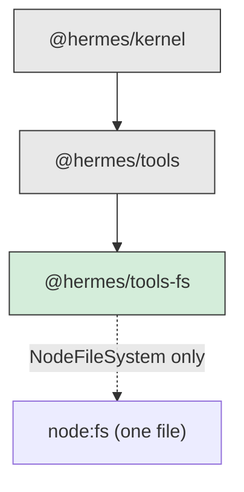

# RFC-0007: Filesystem Tools

| Field         | Value                                        |
| ------------- | -------------------------------------------- |
| Status        | Implemented                                  |
| Date          | 2026-07-17                                   |
| Scope         | `packages/tools-fs` (`@hermes/tools-fs`)     |
| Depends on    | RFC-0001 (kernel), RFC-0006 (tool framework) |
| Supersedes    | —                                            |
| Superseded by | —                                            |

This RFC is the design record for the filesystem tools, and the first of the
concrete tool packages. It also sets the **pattern** the shell, HTTP, and git
tool packages follow, so the parts that generalise are called out as such.

Read this alongside the source. Every claim below is covered by tests in
`packages/tools-fs/tests` (104 of them).

---

## 1. Context

The tool framework (RFC-0006) is the authoring layer. This is the first thing
authored with it: eight tools — read, write, list, stat, exists, mkdir, remove,
move — that let an agent work with files.

The whole difficulty is that the `path` comes **from a model**. A model asked to
"read the config" may decide the config is at `../../../../etc/shadow`, and a
tool that passed that string to `node:fs` would read it. So the design is not
really about eight tools; it is about the two things that sit under them and
make them safe to hand a language model.

## 2. The organising principle

> **A path from a model is untrusted input, and the filesystem is an injected
> edge.**

Two consequences, and everything else follows:

1. Every tool talks to a {@link FileSystem} **port**, never to `node:fs`. The
   port is the injected edge, exactly as `Clock` is for the kernel and
   `Database` is for memory.
2. Every path is confined to a **root** before it reaches the port. Containment
   is one small function, tested exhaustively, that every tool goes through.

## 3. Dependency rules

`@hermes/tools-fs` depends on `@hermes/tools` and `@hermes/kernel`, and on
`node:fs` in **exactly one file** (`node-filesystem.ts`). Everything else — the
tools, the containment, the errors, the in-memory implementation — is
platform-free and would run in a browser.

This is the pattern for every tool package: depend on the framework, keep the
platform coupling in one named implementation of a port, and make the port small
enough that a second implementation is easy.

## 4. Safety: the port and the root

**This is why the package exists, so it comes first.**

### 4.1 The port makes the tools testable and the edge swappable

`FileSystem` is seven methods over `Uint8Array`. `NodeFileSystem` implements it
against the disk; `MemoryFileSystem` implements it in a `Map`. The tools cannot
tell which they have.

`MemoryFileSystem` is **not a mock.** It enforces the same rules the real one
does — a write into a missing directory fails, removing a non-empty directory
needs `recursive`, reading a directory as a file is an error. A mock that
returned whatever a test wanted would let a tool's bug pass in a test and fail
on disk, which is the exact failure a test filesystem exists to prevent. It is
kept faithful by a **shared conformance suite** run against both
implementations, plus a real-disk `NodeFileSystem` test — the one place the
memory implementation's promise is checked against the thing it stands in for.

### 4.2 The root is the security boundary, and it is tiny

`rooted(fs, root)` wraps any filesystem so every path is resolved against `root`
and none escapes. The whole safety argument reduces to one exported pure
function, `resolveWithin(root, path)`, which returns `null` for any path that
escapes — and _that_ reduces to a question about strings, testable with no
filesystem at all.

Three properties make it defensible:

- **It does not consult the disk.** No `realpath`, no `stat` — it is a pure
  function of two strings, so it cannot be defeated by a filesystem race between
  the check and the use (a TOCTOU bug).
- **Absolute paths are re-rooted, not honoured.** `/etc/passwd` under a root of
  `/work` becomes `/work/etc/passwd`, which does not exist, rather than the real
  file, which does.
- **`..` cannot pop above the root.** The moment a `..` would walk out, the
  whole path is refused.

### 4.3 Symlinks, and the one honesty

Rooting alone cannot contain a symlink: a link inside the root can point outside
it, and only the underlying filesystem knows where it resolves. This is a real
limitation (§7.1), and it is met with one concrete decision rather than a
pretence of a full fix: `NodeFileSystem.stat` uses **`lstat`, not `stat`**, so
it reports a symlink _as a symlink_ rather than silently following it to its
target. A caller — a tool, a host, a future policy — can then see
`type: 'symlink'` and decide not to follow it. That is the honest amount of
containment the wrapper can give; the rest is documented, not faked.

## 5. The tools

Eight, each a `HermesTool` with a schema, permissions, and examples. The
interesting decisions are about what a model does with the results.

- **Text, not bytes.** `fs.read` decodes UTF-8 and _refuses_ anything that is
  not valid UTF-8 or contains NUL, with a `NOT_TEXT` error. A model reasons
  about text; handing it the mojibake of a decoded PNG is worse than a clear
  "not a text file" — it looks like data and is noise. `fatal: true` decoding
  means one bad byte refuses the whole read rather than silently substituting a
  replacement character into a config the model is about to rewrite.
- **`maxBytes` is a safety limit, checked from `stat` first.** A model asking to
  read a 2 GB log would otherwise load it whole into memory and then a prompt.
  The size is checked _before_ the read, so an oversized file is refused without
  being loaded — a cap that only checked after would have paid the cost it
  exists to prevent.
- **`fs.exists` fails closed.** Only `NOT_FOUND` becomes `false`; a
  `PERMISSION_DENIED` or `PATH_ESCAPE` propagates. Reporting "does not exist"
  for a path the caller may not access would leak the difference between
  "absent" and "forbidden", which is exactly what a probe wants to hide.
- **Read/write split falls out of permissions.** Read tools declare `fs:read`,
  write tools `fs:write`. A host granting only `fs:read` gets a read-only
  filesystem with no extra wiring, because the permission framework (RFC-0006
  §6) already refuses the rest.

## 6. Structured errors

`node:fs`'s errno grab-bag (`ENOENT`, `EACCES`, `EISDIR`, …) becomes a small
`FileSystemError` vocabulary a model can act on. `ENOENT: open '/work/x'` tells
a model nothing; `NOT_FOUND` with the path does. The mapping is a table
(`fromNodeError`) with a test per row, because a table is exactly the thing that
is subtly wrong (`ENOTEMPTY` is not `NOT_A_DIRECTORY` — it is the "you need
recursive" shape). An unrecognised errno becomes `IO_ERROR` with the original
attached, never swallowed.

## 7. Known limitations and extension points

### 7.1 Symlinks are reported, not resolved

`rooted` confines path _strings_. A symlink is a filesystem object whose target
the wrapper cannot see without touching the disk, so a symlink inside the root
pointing outside it is not caught by containment. It is _reported_ as a symlink
(§4.3), which lets a caller refuse it, but a tool that blindly followed one
could still escape.

A full fix — `realpath` on every operation, or refusing to traverse links at all
— belongs to the `FileSystem` implementation, not the wrapper, because it is a
policy about how to treat links and different backends answer differently. The
honest posture today: containment is airtight for paths, best-effort for links,
and a host that needs more uses a `MemoryFileSystem` (no links exist) or a
backend that resolves them.

### 7.2 Text only, no binary

`fs.read` and `fs.write` deal in UTF-8 text. There is no base64 mode, no byte
ranges, no streaming of a large file in chunks. This is deliberate: an agent's
job here is to read and edit text — configs, code, notes — and a binary-aware
tool is a different tool with a different risk profile (a model asking to write
arbitrary bytes). When a concrete need arrives (an image tool, a
download-to-disk tool) it is a new tool declaring its own schema, not a mode
flag on these.

### 7.3 No file watching, no locking, no partial writes

These are stateless request/response tools. There is no `fs.watch` (a stream of
change events needs the streaming interface the HTTP tools will establish), no
advisory locking (a coordination primitive that belongs above the filesystem),
and `fs.write` replaces a file whole rather than patching it. A patch/edit tool
that applies a diff is a plausible future addition and a genuinely better fit
for a model than "rewrite the whole file" — but it needs a diff format decision,
so it waits for one.

### 7.4 Cancellation is as good as the platform allows

`node:fs/promises` honours an `AbortSignal` on `readFile`/`writeFile` and not on
`stat`/`readdir`/`mkdir`/`rename`/`rm`. For the latter, the signal is checked
_before_ the call, so an already-cancelled operation does no work, but a call in
flight cannot be interrupted mid-syscall. `node-filesystem.ts` documents this
per-method rather than pretending uniform cancellation — the one file whose job
is to not lie about the filesystem should not start by lying about cancellation.

## 8. Invariants — the short list

1. No tool imports `node:fs`; they talk to the `FileSystem` port.
2. `node:fs` lives in exactly one file.
3. Every path a tool receives passes through containment before the port.
4. `resolveWithin` is pure — no disk access, no TOCTOU surface.
5. `MemoryFileSystem` enforces the same rules as `NodeFileSystem`, kept true by
   the shared conformance suite.
6. `fs.read` returns text or a `NOT_TEXT` error — never lossy bytes.
7. Read tools declare `fs:read`; write tools declare `fs:write`.
