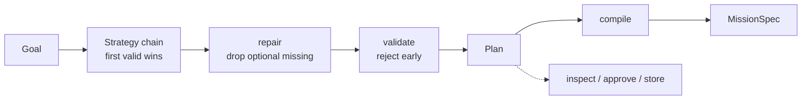

# @hermes/planner

Goals in, missions out.

The kernel runs a graph of tasks and refuses to know where the graph came from —
"the kernel decides _when_ things run. It never knows _what_ they do" (RFC-0001
§2). Something has to decide the shape of that graph. This is that something.

A goal becomes a validated `Plan`. A `Plan` compiles to a `MissionSpec` the host
submits to the kernel.

- **Design record:** [RFC-0003](../../docs/rfcs/RFC-0003-planner.md) — why it is
  shaped this way, what it deliberately cannot do, and what was rejected.
- **Depends on:** `@hermes/kernel` and nothing else. No memory, no model, no
  network, no database.

## What it buys you

The kernel validates a mission's _graph_ but never its _handlers_ — resolution
happens at dispatch. So a mission naming a tool that does not exist is accepted,
runs its upstream tasks **for real**, and only then fails. The email is sent,
the money is spent, and then the typo surfaces.

The planner catches that before anything runs. That is its primary
justification; see RFC-0003 §4 and `tests/kernel-gap.test.ts`, which pins the
gap as a property of the kernel.

## Pipeline



Each stage has one job, and every stage but the first is pure. That is what
makes the interesting behaviour testable without a runtime.

## Usage

```ts
import {
  PlannerService,
  RuntimeCapabilityCatalog,
  TemplateStrategy,
} from '@hermes/planner';

const planner = new PlannerService({
  // Order is policy — see RFC-0003 §5.2. An LlmStrategy goes in front, later.
  strategies: [new TemplateStrategy(myTemplates)],
  catalog: new RuntimeCapabilityCatalog(runtime),
  logger,
});

const { plan, dropped } = await planner.plan({
  statement: 'Summarise my day',
  subject: 'ada',
});

// A Plan is inspectable data. Show it to a human before anything runs.
console.log(
  plan.rationale,
  plan.steps.map((s) => s.intent),
);

const snapshot = await runtime.run(planner.compile(plan));
```

### Recovering a failed mission

A settled mission cannot be resumed (RFC-0001 §11.3); it is succeeded by
another.

```ts
if (snapshot.state === 'failed') {
  // `incomplete` is required and has no default — there is no safe one.
  // See RFC-0003 §7.2 before choosing.
  const recovery = planner.replan(snapshot, { incomplete: 'retry' });
  await runtime.run(planner.compile(recovery));
}
```

Inspect before committing to it:

```ts
const { resume, completed, abandoned } = planner.replanner.analyse(snapshot, {
  incomplete: 'skip',
});
```

## Public API

| Export                                      | What it is                                                         |
| ------------------------------------------- | ------------------------------------------------------------------ |
| `PlannerService`                            | Composition root. `plan`, `compile`, `planMission`, `replan`.      |
| `PlanStrategy`, `buildPlan`                 | The port AI plugs into. Implement it to add a planner.             |
| `TemplateStrategy`, `matches`               | Deterministic strategy matching declared phrasings.                |
| `CapabilityCatalog`                         | The port answering "what can this system do?".                     |
| `StaticCapabilityCatalog`                   | A fixed catalog — tests, manifests, planning before a runtime.     |
| `RuntimeCapabilityCatalog`                  | Reads through to a live kernel `Runtime`.                          |
| `CompositeCapabilityCatalog`                | Several catalogs as one; earlier wins on conflict.                 |
| `PlanValidator`, `graphDepth`               | Rejects a plan before it runs. Reports every issue, not the first. |
| `repairPlan`                                | Drops optional steps whose capabilities are missing.               |
| `compilePlan`, `slugify`                    | Projects a `Plan` onto the kernel's `MissionSpec`.                 |
| `Replanner`                                 | Turns a mission that did not finish back into a plan.              |
| `Plan`, `PlanStep`, `Goal`, `Capability`, … | Domain types. Plain, serialisable data.                            |
| `PlannerError` + subclasses, `toError`      | Everything thrown on purpose, each with a stable `code`.           |

Every export is documented at its definition. `PlannerError.code` is the
contract; message wording is free to change (RFC-0001 §5).

## Adding a strategy

Implement one method. Return `undefined` to decline — a normal outcome that
hands the goal to the next strategy. Throw only when you should have handled it
and broke; the service records it and moves on, which is the whole of "if AI
fails, fall back to deterministic behaviour".

```ts
const llm: PlanStrategy = {
  name: 'llm',
  async propose(goal, ctx) {
    const steps = await myModel.decompose(goal, ctx.catalog.list());
    if (!steps) return undefined;
    return buildPlan('llm', goal, steps, ctx, {
      rationale: '…',
      confidence: 0.7,
    });
  },
};
```

Your proposal need not be valid — the service repairs and validates every
proposal, so you may be optimistic. Honour `ctx.signal` if you await anything.

## Tests

```sh
pnpm test           # 201 tests
pnpm test:coverage  # enforces a 95% threshold
```

Coverage thresholds are enforced rather than observed, with `all: true` so a
module nobody imported counts as 0% rather than vanishing from the report. See
RFC-0003 §8 for why that setting is not cosmetic.
